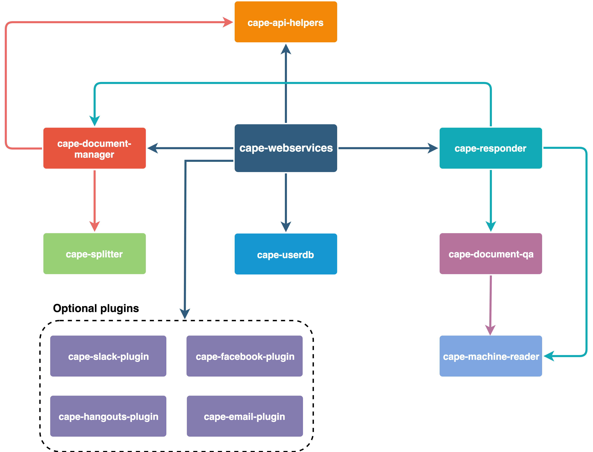

# cape-webservices [](https://circleci.com/gh/bloomsburyai/cape-webservices)
Entrypoint for all backend cape webservices.

## Overview of Cape

Cape is a suite of open-source libraries to manage a questions-answering model that answers questions by "reading" documents automatically. It is based on state-of-the-art machine reading models trained on massive datasets, and includes several mechanisms to make it easy to use and improve based on user feedback. It has been designed to be *portable*, i.e. works on a single laptop or on a cluster of parallel machines to speedup computation, and is *Open Source friendly* to be used at all expertise levels.

It enables users to 
- upload documents and answer questions extracted from them, 
- update models by adding a "saved reply", i.e. a pre-defined answer,
- manage users, documents and saved replies.

There are several ways to use Cape : 
    
   * As a python library :
   ``` 
    from cape_responder.responder_core import Responder
    Responder.get_answers_from_documents('my-token','How easy is Cape to use', text ="Cape is an open source large-scale question answering system and is super easy to use!")
   ```
   * As a python service : `python3 -m cape_webservices.run`
   * As a standalone Docker container : `docker run -p 5050:5050 bloomsburyai/cape`
   * As an app with UI (more info here)
   * As a distributed cluster (more info here)
   * As a slack bot (video [here](https://vimeo.com/258053984), more info here)
   * AI-in-the-middle email answering system (video [here](https://vimeo.com/258794094), more info here)
   * As a Facebook bot (more info here)
   * As a Hangouts bot (more info here)
   
## Quick start

### Standalone webapp with Docker

You can run a standalone version of the webapp that includes a management dashboard.
After installing [docker](https://www.docker.com/community-edition), update and run the Cape image:

`docker pull bloomsburyai/cape && docker run bloomsburyai/cape`

This will launch both the backend and the frontend webservices, by default it will also create tunnels for both, outputting the public urls:

   * To use the frontend just browse to the given url, it will be something similar to :
 **https://`RANDOM_STRING_HERE`.ngrok.io?configuration={"api":{"backendURL":"RANDOM_STRING_HERE","timeout":"15000"}}
   * To use the backend you can use our client (documentation [here](http://cape-client.readthedocs.io/en/latest/) or make your own by integrating our HTTP API (documentation [here](https://`RANDOM_STRING_HERE`.ngrok.io/documentation/index.html)))

### Quick Start Guide with Docker

1. Pull the latest version of the Docker image (it will take a few moments to download all dependencies and a machine reading model):
`docker pull bloomsburyai/cape`

1. Run the Docker container and launch an IPython console within it using the following command: 
`docker run -ti -p 5050:5050 -p 5051:5051 bloomsburyai/cape ipython3`

1. Import Responder: 
`from cape_responder.responder_core import Responder`

1. Ask a question and store the response (which is a list of answers) and display the first answer using: `response = Responder.get_answers_from_documents('my-token','How easy is Cape to use?', text="Cape is an open source large-scale question answering system and is super easy to use!"); print(response[0]['answerText'])`

1. If you are interested in understanding a bit more about what the response looks like, display the full response using: `print(response)`

## Structure



In summary this is how Cape is organized:
   
   * [cape-webservices](https://github.com/bloomsburyai/cape-webservices) Backend server providing the full HTTP API, depends on :
      * [cape-responder](https://github.com/bloomsburyai/cape-responder) Unique high level interface for distributing and creating machine reading tasks,depending on :
        - [cape-machine-reader](https://github.com/bloomsburyai/cape-machine-reader) Module to integrate machine reading models
        - [cape-document-qa](https://github.com/bloomsburyai/cape-document-qa) Integration of a state of machine reading model, with training and evaluation scripts
      * [cape-document-manager](https://github.com/bloomsburyai/cape-document-qa) Interface to manage document and annotations, using SQLite as an example storage backend, depends on :
        - [cape-splitter](https://github.com/bloomsburyai/cape-splitter) Package to split documents into chunks without breaking sentences
      * [cape-userdb](https://github.com/bloomsburyai/cape-userdb), Package to manage and store users and configurations
      * [cape-api-helpers](https://github.com/bloomsburyai/cape-api-helpers), HTTP API utility functions
   * [cape-frontend](https://github.com/bloomsburyai/cape-frontend) Frontend server (not in the diagram) it uses the backend server API to provide a management dashboard to the users
